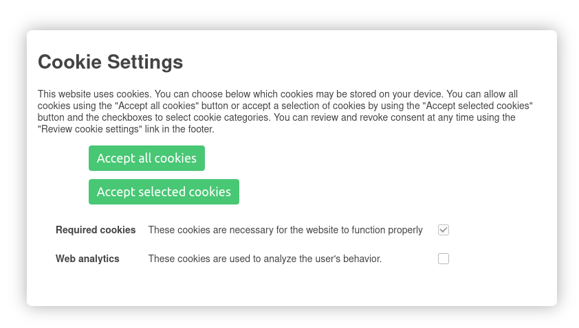

# CookieYesNo
## An easy to use GDPR-compliant cookie-banner


 	
&#9989; GDPR-complient

&#9989; Easy to Use

&#9989; Mobile friendly

&#9989; Small memory footprint

&#9989; Highly customizable

## Usage
The banner on the screenshot above has been created using only the 14 lines you can see below.

```js
var cyn = new CookieYesNo({
  categories: {
    required: {
      name: 'Required cookies',
      description: 'These cookies are necessary for the website to function properly',
      accepted: true,
      changeable: false
    },
    analytics: {
      name: 'Web analytics',
      description: 'These cookies are used to analyze the user\'s behavior.'
    }
  }
});
```

## Documentation
### Configuration
The configuration is the only argument of `new CookieYesNo(config)` and is a map, The following things can / have to be configured:

* `categories` *(Map)* **Required » Take a look at the [category configuration](#category-configuration)**
* `text` *(Map) [optional]* [Link placeholders](#link-placeholders) can be used
  * `above` *(String) [optional]* Text above the section where the user can select specific cookie-categories
  * `below` *(String) [optional]* Text below the section where the user can select specific cookies
* `title` *(String) [optional - by default "Cookie Settings"]* Title of the banner 
* `acceptAllButtonText` *(String) [optional - by default "Accept all cookies"]* Text of the button that's for accepting all cookies
* `acceptSelectionButtonText` *(String) [optional - by default "Accept selected cookies"]* Text of the button that's for accepting only selected cookie categories
* `privacyPolicy` *(Map) [optional]*
  * `url` *(String)* URL of your privacy policy (in case the banner covers the link on the actual page)
  * `text` *(String)* Text of the link
* `cookiePolicy` *(Map) [optional]*
  * `url` *(String)* URL of your cookie policy (String)
  * `text` *(String)* Text of the link
* `imprint` *(Map) [optional]*
  * `url` *(String)* URL of your imprint (required in case that the banner covers the link on the actual page)
  * `text` *(String)* Text of the link
* `version` *(String) [optional]* Version of the configuration - if you change the version - the user has to consent again (for the case that you change something in the categories) - Use any text you like to, I recommed the date of the change. If not version has been set before, the user also give his consent again.

### Category configuration
Each cookie category is an item in the `categories`-Map.
Here a short example:
```js
categories: {
  required: {
    name: 'Required cookies',
    accepted: true,          // preselected
    description: 'These cookies are necessary for the website to function properly.',
    changeable: false       // user can not change this option
  },
  analytics: {
    name: 'Web Analytics',
    description: 'These cookies are used to analyze the user\'s behavior.'
  }
}
```

#### Configuration possibilities of a category
* `name` *(String)* **Required** Name/Title of the cookie category
* `description` *(String)* **Required** Description of the cookie category
* `accepted` *(Boolean) [optional - by default false]* If the category is preselected
* `changeable` *(Boolean) [optional - by default true]* If the user can change the value
* `reloadOnReject` *(Boolean) [optional - by default true]* If the page is reloaded if the cookie category gets rejected - We need to do this to stop scripts from running that would set cookies.
* `onAccept` *(Array) [optional - by default []]* Shortcut for [Events](#events)
* `onReject` *(Array) [optional - by default []]* Shortcut for [Events](#events)
* `onChange` *(Array) [optional - by default []]* Shortcut for [Events](#events)

### Script blocking
#### Blocking external scripts
You have to replace `src` with `data-cyn-src` and have to set the `type` to `text/plain`. The `data-cyn-require` attribute specifies which cookie category has to be allowed to run the script. So `analytics` has to be the key of the Web Analytics category in the `categories` map.
```html
<script type="text/plain" data-cyn-src="analytics.js" data-cyn-require="analytics"></script>
```
#### Blocking inline scripts
**Caution: May not block the execution of the script in older Firefox versions!  External script blocking (above) is safe to use as well as Events (below). Use these medthods instead.**
The `type` attribute has to be set to `text/plain`. The script will be executed when the category with the key `analytics` is allowed.
```html
<script type="text/plain" data-cyn-require="analytics">
  // YOUR CODE HERE
</script>
```

### Events
Note: the `category` argument in the methods below is the key of the specific category in the `categories` map in the configuration map.
#### `onAccept(category, callback)`
Callback function gets executed when the specified category gets acceped.
#### `onReject(category, callback)`
Callback function gets executed when the specified category gets rejected. Explicitly return `false` if you don't want to reload the site. This can also be done by the config. If you like to reload the page either return nothing or return `true`.
#### `onChange(category, callback)`
Callback function gets executed when the specified category gets changed. The first argument of the `callback` function is a *Boolean* that states if the category has been accepted *(true)* or rejected *(false)*.


First the `onChange` callbacks are executed, then the scripts are activated if necessary and then `onAccept` and `onReject` callbacks are executed. 

### Other methods
#### `getSettings()`
Get the current cookie settings as a *map*.
#### `reviewSettings()`
Let the user review his consent.
#### `show()`
Show the cookie banner.
#### `hide()`
Hide the cookie banner.

### Link placeholders
Link placeholders can be used in the `text.above` and `text.below`.
Simply put `PRIVACY_POLICY`, `COOKIE_POLICY`, or `IMPRINT` in the String.
These will be replaced with the matching links. Note: In order to use this feature you have to specify the links in the configuration.

### Modify the banner
It's pretty simple: just use CSS-rules.
The following classes are available:

* `.cyn-banner`: main banner element
* `.cyn-categories`: table containing the different cookie categories
* `.cyn-btn-save`: save settings button 
* `.cyn-btn-accept-all`: accept all button

---
Based on https://github.com/rollup/rollup-starter-app and https://github.com/rollup/rollup-starter-lib (both MIT License) Take a look at LICENSE_ROLLUP_STARTER_APP and LICENSE_ROLLUP_STARTER_LIB.
